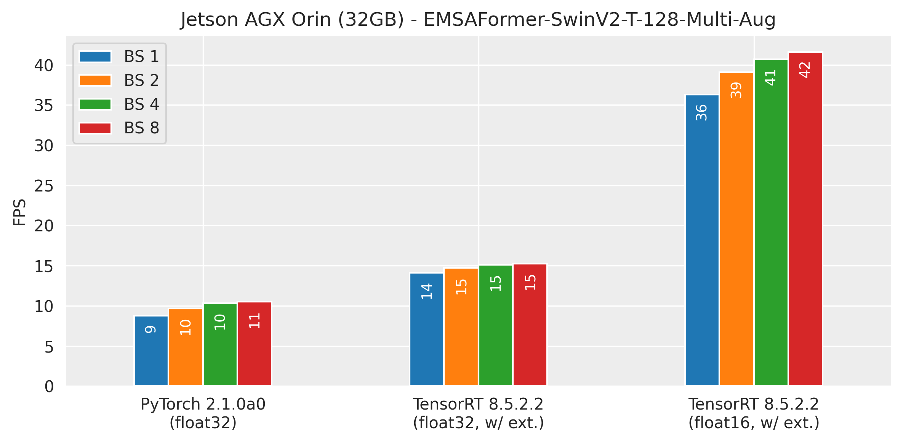

# EMSAFormer: Efficient Multi-Task Scene Analysis with RGB-D Transformers
This repository contains the code to our paper 
"EMSAFormer: Efficient Multi-Task Scene Analysis with RGB-D Transformers" 
([IEEE Xplore](https://ieeexplore.ieee.org/document/10191977), [arXiv](https://arxiv.org/pdf/2306.05242.pdf))

EMSAFormer builds on top of our previous work, 
[EMSANet](https://github.com/TUI-NICR/EMSANet), to efficiently perform tasks 
such as semantic and instance segmentation (panoptic segmentation), instance 
orientation estimation, and scene classification. In EMSAFormer, we replaced 
the dual CNN-based encoder of EMSANet with a single Swin Transformer.


The repository includes code for training, evaluating, and applying our 
network. We also provide code for exporting the model to the ONNX format.
Additionally, we have implemented a custom TensorRT extension, based on 
NVIDIA's [FasterTransformer](https://github.com/NVIDIA/FasterTransformer) 
extension, for accelerating inference.

## License and Citations
The source code is published under Apache 2.0 license, see 
[license file](LICENSE) for details.

If you use the source code or the network weights, please cite the following 
paper ([IEEE Xplore](https://ieeexplore.ieee.org/document/10191977), [arXiv](https://arxiv.org/abs/2306.05242)):


> Fischedick, S., Seichter, D., Schmidt, R., Rabes, L., Gross, H.-M.
*Efficient Multi-Task Scene Analysis with RGB-D Transformers*,
in IEEE International Joint Conference on Neural Networks (IJCNN), pp. 1-10, 2023.

<details>
<summary>BibTeX</summary>

```bibtex
@inproceedings{emsaformer2023ijcnn,  
  title={{Efficient Multi-Task Scene Analysis with RGB-D Transformers}},
  author={Fischedick, S{\"o}hnke and Seichter, Daniel and Schmidt, Robin and Rabes, Leonard and Gross, Horst-Michael},
  booktitle={IEEE International Joint Conference on Neural Networks (IJCNN)},
  year={2023},
  pages={1-10},
  doi={10.1109/IJCNN54540.2023.10191977}
}

@article{emsaformer2023,
  title={Efficient {Multi-Task} Scene Analysis with {RGB-D} Transformers},
  author={S{\"o}hnke B. Fischedick and Daniel Seichter and Robin Schmidt and Leonard Rabes and Horst-Michael Gross},
  journal={arXiv preprint arXiv:2306.05242},
  year={2023}
}
```

Note that the preprint was accepted to be published in IEEE International Joint Conference on Neural Networks (IJCNN) 2023.

</details>

## Content

- [Installation](#installation): Set up the environment.
- [Results & Weights](#results-weights): Overview about major results and pretrained network weights.
- [Evaluation](#evaluation): Reproduce results reported in our paper.
- [Inference](#inference): Apply trained models.
    - [Dataset Inference](#dataset-inference): Apply trained model to samples from dataset.
    - [Sample Inference](#sample-inference): Apply trained model to samples in ./samples.
    - [Time Inference](#time-inference): Time inference on NVIDIA Jetson AGX Orin using TensorRT.
- [Training](#training): Train new EMSAFormer model.
- [Changelog](#changelog): List of changes and updates made to the project.

## Installation
1. Clone repository:
    ```bash
    # do not forget the '--recursive'
    git clone --recursive https://github.com/TUI-NICR/EMSAFormer

    # navigate to the cloned directory (required for installing some dependencies and to run the scripts later)
    cd EMSAFormer
    ```

2. Create conda environment and install all dependencies:
    ```bash
    # option 1: create conda environment from provided YAML file with Python 3.11.0 and PyTorch 2.3 (latest tested version)

    conda env create -f emsaformer_environment_pytorch_2_3.yml
    conda activate emsaformer
    ```

    ```bash
    # option 2: create conda environment from provided YAML file with Python 3.8.16 and PyTorch 2.0 (original publication)

    conda env create -f emsaformer_environment_pytorch_2_0.yml
    conda activate emsaformer
    ```

    ```bash
    # option 3: create new conda environment manually (original publication)

    conda create -n emsaformer python=3.8 anaconda
    conda activate emsaformer

    # remaining conda dependencies
    # note: PyTorch 2.0+ works as well
    conda install pytorch==2.0.0 torchvision==0.15.0 torchaudio==2.0.0 pytorch-cuda=11.7 -c pytorch -c nvidia

    # remaining pip dependencies
    python -m pip install 'opencv-python==4.2.0.34'    # newer versions may work as well
    python -m pip install torchmetrics==0.10.2
    python -m pip install wandb==0.14.2
    ```

3. Install submodule packages:
    ```bash
    # dataset package
    python -m pip install -e "./lib/nicr-scene-analysis-datasets[withpreparation]"

    # multitask scene analysis package
    python -m pip install -e "./lib/nicr-multitask-scene-analysis"
    ```

4. Prepare datasets:  
    We trained our networks on 
    [NYUv2](https://cs.nyu.edu/~silberman/datasets/nyu_depth_v2.html), 
    [SUNRGB-D](https://rgbd.cs.princeton.edu/), and
    [ScanNet](http://www.scan-net.org/). 

    Please follow the instructions given in `./lib/nicr-scene-analysis-datasets` or [HERE](https://github.com/TUI-NICR/nicr-scene-analysis-datasets/tree/v0.7.0) to prepare the datasets.
    In the following, we assume that they are stored at `./datasets`
    
    > Use `--instances-version emsanet` when preparing the SUNRGB-D dataset to reproduce reported results. 
      See notes in evaluation section for more details.


## Results & Weights
We provide the weights for our selected EMSAFormer-SwinV2-T-128-Multi-Aug
(with a modified SwinV2-T backbone) on NYUv2, SUNRGB-D, and ScanNet:

| Dataset                 | Model                                   | mIoU  | mIoU*  | PQ    | RQ    | SQ    | MAAE  | bAcc  | FPS (50W/30W)**        | URL  |
|-------------------------|-----------------------------------------|:-----:|:------:|:-----:|:-----:|:-----:|:-----:|:-----:|:------------:|------|
| NYUv2 (test)            | SwinV2-T-128-Multi-Aug                  | 51.06 | 51.76  | 43.28 | 52.48 | 81.43 | 18.26 | 78.80 | 36.5 / 25.6  | [Download](https://drive.google.com/uc?id=1qj7FL2kSA-gu_XdDNtsNaVfWZScrOXnu) |
|                         | SwinV2-T-128-Multi-Aug (Sem(SegFormer)) | 50.23 | 51.34  | 43.41 | 52.23 | 81.75 | 18.94 | 77.70 | 39.1 / 27.3  | [Download](https://drive.google.com/uc?id=1NeL_4KFFKqQxwMyB1oHewfsUb-4SkAoS) |
| SUNRGB-D (test)         | SwinV2-T-128-Multi-Aug                  | 48.52 | 45.12  | 50.08 | 59.08 | 84.68 | 15.32 | 62.01 | 36.5 / 25.6  | [Download](https://drive.google.com/uc?id=1FHH817pAVIAjIWxDggrCtdszM8PN9KCB) |
|                         | SwinV2-T-128-Multi-Aug (Sem(SegFormer)) | 48.61 | 45.79  | 51.70 | 60.12 | 84.65 | 14.00 | 61.97 | 39.1 / 27.3  | [Download](https://drive.google.com/uc?id=1furt5IF_MOA6AeVD4sSm8ZaUASh4quaT) |
| ScanNet (test)          | SwinV2-T-128-Multi-Aug                  | 63.78 | 61.93  | 49.70 | 59.15 | 83.31 | ***   | 48.82 | 36.5 / 25.6  | [Download](https://drive.google.com/uc?id=11mMFdI6mPh_SyQ5y8jxRtc3Sd9p4Q48L) |
|                         | SwinV2-T-128-Multi-Aug (Sem(SegFormer)) | 64.75 | 62.66  | 51.18 | 61.01 | 83.20 | ***   | 49.69 | 39.1 / 27.3  | [Download](https://drive.google.com/uc?id=1vbL5OCkiiyRDmZIf9lHJ48xnC5NptYwd) |

\* This mIoU is after merging the semantic and instance segmentation to the 
panoptic segmentation. Since merging is focused on instances, the mIoU might 
change slightly compared to the one obtained from semantic decoder.  
\*\* We report the FPS for an NVIDIA Jetson AGX Orin (Jetpack 5.1.1, 
TensorRT 8.5.2, Float16) without postprocessing (as it is not optimized so far). 
Note that we only report the inference time for NYUv2 in our paper as it has 
the same or more classes than the other datasets. Thus, the FPS for the other
datasets can be slightly higher. The performance is reported with a measured 
power consumption of 50W and 30W.  
\*\*\* Orientations are not available for ScanNet

The checkpoints denoted by "(Sem(SegFormer))" use a smaller MLP-based decoder
for performing semantic segmentation, instead of the EMSANet decoder.  
Download and extract the models to `./trained_models`.

## Evaluation
To reproduce results for the full multi-task approach, use `main.py` together 
with `--validation-only`.

> Note that building the model correctly depends on the respective dataset and 
the tasks the model was trained on.

### NYUv2

To evaluate on NYUv2 with EMSANet decoder (for semantic segmentation), run:
```bash
python main.py \
    --dataset nyuv2 \
    --dataset-path ./datasets/nyuv2 \
    --tasks semantic scene instance orientation \
    --enable-panoptic \
    --input-modalities rgbd \
    --rgbd-encoder-backbone swin-multi-t-v2-128 \
    --encoder-normalization layernorm \
    --no-pretrained-backbone \
    --semantic-decoder emsanet \
    --semantic-encoder-decoder-fusion swin-ln-add \
    --semantic-decoder-n-channels 512 256 128 \
    --semantic-decoder-upsampling learned-3x3-zeropad \
    --weights-filepath ./trained_models/nyuv2/nyuv2_swin_multi_t_v2_128_emsanet_decoder.pth \
    --checkpointing-metrics valid_semantic_miou bacc mae_gt_deg panoptic_deeplab_semantic_miou panoptic_all_deeplab_pq \
    --validation-batch-size 4 \
    --validation-only \
    --skip-sanity-check \
    --wandb-mode disabled
```
```text
Validation results:
{
...
'valid_instance_all_with_gt_deeplab_pq': tensor(0.5906, dtype=torch.float64),
...
'valid_orientation_mae_gt_deg': tensor(20.0162, dtype=torch.float64),
...
'valid_panoptic_all_with_gt_deeplab_pq': tensor(0.4341, dtype=torch.float64),
...
'valid_panoptic_all_with_gt_deeplab_rq': tensor(0.5253, dtype=torch.float64),
...
'valid_panoptic_all_with_gt_deeplab_sq': tensor(0.8175, dtype=torch.float64),
...
'valid_panoptic_deeplab_semantic_miou': tensor(0.5176),
...
'valid_panoptic_mae_deeplab_deg': tensor(18.2569, dtype=torch.float64),
...
'valid_scene_bacc': tensor(0.7880),
...
'valid_semantic_miou': tensor(0.5106),
...
}
```

To evaluate on NYUv2 with MLP-based decoder (for semantic segmentation), run:
```bash
python main.py \
    --dataset nyuv2 \
    --dataset-path ./datasets/nyuv2 \
    --tasks semantic scene instance orientation \
    --enable-panoptic \
    --input-modalities rgbd \
    --rgbd-encoder-backbone swin-multi-t-v2-128 \
    --encoder-normalization layernorm \
    --no-pretrained-backbone \
    --semantic-decoder segformermlp \
    --semantic-encoder-decoder-fusion swin-ln-select \
    --semantic-decoder-n-channels 256 128 64 64 \
    --semantic-decoder-upsampling bilinear \
    --weights-filepath ./trained_models/nyuv2/nyuv2_swin_multi_t_v2_128_segformermlp_decoder.pth \
    --checkpointing-metrics valid_semantic_miou bacc mae_gt_deg panoptic_deeplab_semantic_miou panoptic_all_deeplab_pq \
    --validation-batch-size 4 \
    --validation-only \
    --skip-sanity-check \
    --wandb-mode disabled
```
```text
Validation results:
{
...
'valid_instance_all_with_gt_deeplab_pq': tensor(0.5875, dtype=torch.float64),
...
'valid_orientation_mae_gt_deg': tensor(20.9530, dtype=torch.float64),
...
'valid_panoptic_all_with_gt_deeplab_pq': tensor(0.4341, dtype=torch.float64),
...
'valid_panoptic_all_with_gt_deeplab_rq': tensor(0.5253, dtype=torch.float64),
...
'valid_panoptic_all_with_gt_deeplab_sq': tensor(0.8175, dtype=torch.float64),
...
'valid_panoptic_deeplab_semantic_miou': tensor(0.5134),
...
'valid_panoptic_mae_deeplab_deg': tensor(18.9417, dtype=torch.float64),
...
'valid_scene_bacc': tensor(0.7770),
...
'valid_semantic_miou': tensor(0.5023),
...
}
```

### SUNRGB-D
> We refactored and updated instance annotation creation from 3D boxes for 
  SUNRGB-D in `nicr-scene-analysis-datasets` == 0.6.0. The resulting annotations 
  feature a lot of more instances; however, it is also changing the ground 
  truth for the evaluation below. For more details and a comparison between 
  both versions, we refer to our follow-up work Panoptic 
  Mapping([GitHub](https://github.com/TUI-NICR/panoptic-mapping), 
  [arXiv](https://arxiv.org/abs/2309.13635)) that proposes the refined 
  annotations.
  To reproduce reported EMSANet paper results either use 
  `nicr-scene-analysis-datasets` >= 0.7.0 and prepare the SUNRGB-D dataset with 
  `--instances-version emsanet` (or go back with both reposities and use 
  `nicr-scene-analysis-datasets` <= 0.6.0).
  For backward compatibility, i.e., to still be able to load a SUNRGB-D dataset 
  prepared with `nicr-scene-analysis-datasets` < 0.7.0, you can pass 
  `--sunrgbd-instances-version anyold` to `main.py`; however, use this only if
  you know what you are doing!  
  We recommend re-preparing the SUNRGB-D dataset 
  with `nicr-scene-analysis-datasets` >= 0.7.0 as described above to avoid 
  any confusion.

To evaluate on SUNRGB-D with EMSANet decoder (for semantic segmentation), run:
```bash
python main.py \
    --dataset sunrgbd \
    --dataset-path ./datasets/sunrgbd \
    --sunrgbd-instances-version emsanet \
    --sunrgbd-depth-do-not-force-mm \
    --tasks semantic scene instance orientation \
    --enable-panoptic \
    --input-modalities rgbd \
    --rgbd-encoder-backbone swin-multi-t-v2-128 \
    --encoder-normalization layernorm \
    --no-pretrained-backbone \
    --semantic-decoder emsanet \
    --semantic-encoder-decoder-fusion swin-ln-add \
    --semantic-decoder-n-channels 512 256 128 \
    --semantic-decoder-upsampling learned-3x3-zeropad \
    --weights-filepath ./trained_models/sunrgbd/sunrgbd_swin_multi_t_v2_128_emsanet_decoder.pth \
    --checkpointing-metrics valid_semantic_miou bacc mae_gt_deg panoptic_deeplab_semantic_miou panoptic_all_deeplab_pq \
    --validation-batch-size 4 \
    --validation-only \
    --skip-sanity-check \
    --wandb-mode disabled
```
```text
Validation results:
{
...
'valid_instance_all_with_gt_deeplab_pq': tensor(0.6114, dtype=torch.float64),
...
'valid_orientation_mae_gt_deg': tensor(16.9858, dtype=torch.float64),
...
'valid_panoptic_all_with_gt_deeplab_pq': tensor(0.5082, dtype=torch.float64),
...
'valid_panoptic_all_with_gt_deeplab_rq': tensor(0.5908, dtype=torch.float64),
...
'valid_panoptic_all_with_gt_deeplab_sq': tensor(0.8469, dtype=torch.float64),
...
'valid_panoptic_deeplab_semantic_miou': tensor(0.4512),
...
'valid_panoptic_mae_deeplab_deg': tensor(15.3224, dtype=torch.float64),
...
'valid_scene_bacc': tensor(0.6201),
...
'valid_semantic_miou': tensor(0.4852),
...
}
```

To evaluate on SUNRGB-D with MLP-based decoder (for semantic segmentation), run:
```bash
python main.py \
    --dataset sunrgbd \
    --dataset-path ./datasets/sunrgbd \
    --sunrgbd-instances-version emsanet \
    --sunrgbd-depth-do-not-force-mm \
    --tasks semantic scene instance orientation \
    --enable-panoptic \
    --input-modalities rgbd \
    --rgbd-encoder-backbone swin-multi-t-v2-128 \
    --encoder-normalization layernorm \
    --no-pretrained-backbone \
    --semantic-decoder segformermlp \
    --semantic-encoder-decoder-fusion swin-ln-select \
    --semantic-decoder-n-channels 256 128 64 64 \
    --semantic-decoder-upsampling bilinear \
    --weights-filepath ./trained_models/sunrgbd/sunrgbd_swin_multi_t_v2_128_segformermlp_decoder.pth \
    --checkpointing-metrics valid_semantic_miou bacc mae_gt_deg panoptic_deeplab_semantic_miou panoptic_all_deeplab_pq \
    --validation-batch-size 4 \
    --validation-only \
    --skip-sanity-check \
    --wandb-mode disabled
```
```text
Validation results:
{
...
'valid_instance_all_with_gt_deeplab_pq': tensor(0.6120, dtype=torch.float64),
...
'valid_orientation_mae_gt_deg': tensor(15.9133, dtype=torch.float64),
...
'valid_panoptic_all_with_gt_deeplab_pq': tensor(0.5170, dtype=torch.float64),
...
'valid_panoptic_all_with_gt_deeplab_rq': tensor(0.6012, dtype=torch.float64),
...
'valid_panoptic_all_with_gt_deeplab_sq': tensor(0.8465, dtype=torch.float64),
...
'valid_panoptic_deeplab_semantic_miou': tensor(0.4579),
...
'valid_panoptic_mae_deeplab_deg': tensor(13.9994, dtype=torch.float64),
...
'valid_scene_bacc': tensor(0.6197),
...
'valid_semantic_miou': tensor(0.4861),
...
}
```

### ScanNet

To evaluate on ScanNet with EMSANet decoder (for semantic segmentation), run:
```bash
python main.py \
    --dataset scannet \
    --dataset-path ./datasets/scannet \
    --scannet-semantic-n-classes 20 \
    --tasks semantic scene instance \
    --enable-panoptic \
    --input-modalities rgbd \
    --rgbd-encoder-backbone swin-multi-t-v2-128 \
    --encoder-normalization layernorm \
    --no-pretrained-backbone \
    --semantic-decoder emsanet \
    --semantic-encoder-decoder-fusion swin-ln-add \
    --semantic-decoder-n-channels 512 256 128 \
    --semantic-decoder-upsampling learned-3x3-zeropad \
    --weights-filepath ./trained_models/scannet/scannet_swin_multi_t_v2_128_emsanet_decoder.pth \
    --checkpointing-metrics valid_semantic_miou bacc mae_gt_deg panoptic_deeplab_semantic_miou panoptic_all_deeplab_pq \
    --validation-batch-size 4 \
    --validation-only \
    --skip-sanity-check \
    --wandb-mode disabled
```
```text
Validation results:
{
...
'valid_instance_all_with_gt_deeplab_pq': tensor(0.6669, dtype=torch.float64),
...
'valid_panoptic_all_with_gt_deeplab_pq': tensor(0.4970, dtype=torch.float64),
...
'valid_panoptic_all_with_gt_deeplab_rq': tensor(0.5915, dtype=torch.float64),
...
'valid_panoptic_all_with_gt_deeplab_sq': tensor(0.8331, dtype=torch.float64),
...
'valid_panoptic_deeplab_semantic_miou': tensor(0.6193),
...
'valid_scene_bacc': tensor(0.4882),
...
'valid_semantic_miou': tensor(0.6378),
...
}
```

To evaluate on ScanNet with MLP-based decoder (for semantic segmentation), run:
```bash
python main.py \
    --dataset scannet \
    --dataset-path ./datasets/scannet \
    --scannet-semantic-n-classes 20 \
    --tasks semantic scene instance \
    --enable-panoptic \
    --input-modalities rgbd \
    --rgbd-encoder-backbone swin-multi-t-v2-128 \
    --encoder-normalization layernorm \
    --no-pretrained-backbone \
    --semantic-decoder segformermlp \
    --semantic-encoder-decoder-fusion swin-ln-select \
    --semantic-decoder-n-channels 256 128 64 64 \
    --semantic-decoder-upsampling bilinear \
    --weights-filepath ./trained_models/scannet/scannet_swin_multi_t_v2_128_segformermlp_decoder.pth \
    --checkpointing-metrics valid_semantic_miou bacc mae_gt_deg panoptic_deeplab_semantic_miou panoptic_all_deeplab_pq \
    --validation-batch-size 4 \
    --validation-only \
    --skip-sanity-check \
    --wandb-mode disabled
```
```text
Validation results:
{
...
'valid_instance_all_with_gt_deeplab_pq': tensor(0.6771, dtype=torch.float64),
...
'valid_panoptic_all_with_gt_deeplab_pq': tensor(0.5118, dtype=torch.float64),
...
'valid_panoptic_all_with_gt_deeplab_rq': tensor(0.6101, dtype=torch.float64),
...
'valid_panoptic_all_with_gt_deeplab_sq': tensor(0.8320, dtype=torch.float64),
...
'valid_panoptic_deeplab_semantic_miou': tensor(0.6266),
...
'valid_scene_bacc': tensor(0.4969),
...
'valid_semantic_miou': tensor(0.6475),
...
}
```

## Inference
We provide scripts for inference on both samples drawn from one of our used 
datasets (`main.py` with additional arguments) and samples located in 
`./samples` (`inference_samples.py`). 

> Note that building the model correctly depends on the respective dataset the 
model was trained on.

### Dataset Inference
To run inference on a dataset with the full multi-task approach, use `main.py` 
together with `--validation-only` and `--visualize-validation`.
By default the visualized outputs are written to a newly created directory next 
to the weights. However, you can also specify the output path with 
`--visualization-output-path`.

Example: To apply EMSAFormer trained on NYUv2 to samples from NYUv2, run:
```bash
python main.py \
    --dataset nyuv2 \
    --dataset-path ./datasets/nyuv2 \
    --tasks semantic scene instance orientation \
    --enable-panoptic \
    --input-modalities rgbd \
    --rgbd-encoder-backbone swin-multi-t-v2-128 \
    --encoder-normalization layernorm \
    --no-pretrained-backbone \
    --semantic-decoder segformermlp \
    --semantic-encoder-decoder-fusion swin-ln-select \
    --semantic-decoder-n-channels 256 128 64 64 \
    --semantic-decoder-upsampling bilinear \
    --weights-filepath ./trained_models/nyuv2/nyuv2_swin_multi_t_v2_128_segformermlp_decoder.pth \
    --checkpointing-metrics valid_semantic_miou bacc mae_gt_deg panoptic_deeplab_semantic_miou panoptic_all_deeplab_pq \
    --validation-batch-size 4 \
    --validation-only \
    --visualize-validation \
    --visualization-output-path ./visualized_outputs/nyuv2 \
    --skip-sanity-check \
    --wandb-mode disabled
```
Similarly, the same can be applied to SUNRGB-D and ScanNet
(see parameters in [evaluation section](#evaluation)).
> Note that the `inference_dataset.py` script can be used to predict on the 
test data of ScanNet and write the results in the format which is required 
for the official evaluation servers.
### Sample Inference
Use `inference_samples.py` to apply a trained model to the sample from a 
Kinect v2 given in `./samples`.

> Note that the dataset argument is required to determine the correct dataset
configuration (classes, colors, ...) and to build the model correctly. 
However, you do not need to prepare the respective dataset.
Furthermore, depending on the given depth images and the 
used dataset for training, an additional depth scaling might be necessary. 
The provided example depth image is in millimeters (1m equals to a depth 
value of 1000).

```bash
python inference_samples.py \
    --dataset sunrgbd \
    --sunrgbd-depth-do-not-force-mm \
    --tasks semantic scene instance orientation \
    --enable-panoptic \
    --raw-depth \
    --depth-max 8000 \
    --depth-scale 8 \
    --instance-offset-distance-threshold 40 \
    --weights-filepath ./trained_models/sunrgbd/sunrgbd_swin_multi_t_v2_128_segformermlp_decoder.pth \
    --show-results
```


> Note that the model was not trained on that kind of incomplete depth images.

> Note that the `--instance-offset-distance-threshold` argument is used to 
assign an instance ID of 0 to pixels if they have a distance greater than 
40 pixels from the nearest center. During panoptic merging, these pixels are 
assigned to the void class.

### Time Inference
To reproduce the timings on an NVIDIA Jetson AGX Orin 32GB, a custom TensorRT 
extension, based on NVIDIA's [FasterTransformer](https://github.com/NVIDIA/FasterTransformer), 
is required. 
Additionally, some modifications for the ONNX export are required to allow the export of arbitrary Swin-Transformer-based models.

Please follow the instructions given in [`tensorrt_swin/README.md`](tensorrt_swin/README.md) to build the 
proposed extension.
Subsequently, you can run `inference_time.bash` to reproduce the reported timings (see table above).

Below, we compare the inference timings of the EMSAFormer with PyTorch and with TensorRT on the NVIDIA Jetson AGX Orin 32GB.



> Note that our custom TensorRT extension also works with newer TensorRT versions.
  For more details, we refer to the [`tensorrt_swin/README.md`](tensorrt_swin/README.md).

## Training
Use `main.py` to train EMSAformer on NYUv2, SUNRGB-D, ScanNet, or any other 
dataset that you implemented following the implementation of the provided 
datasets.

> Note that training our EMSAFormer with our selected SwinV2-T-128-Multi-Aug as
encoder requires pretrained weights. You can download our pretrained weights on 
ImageNet from [Link](https://drive.google.com/uc?id=10hUuPmO49yNIKVPoo6LlWVZS1txccn57).

> Note that we trained all models on NVIDIA A100-SXM4-40GB GPUs with batch 
size of 8. However, training the full multi-task approach requires ~25GB 
of VRAM, so a smaller GPU may not work. We did not observe any great boost 
from larger batch sizes.

Example: Train our full multi-task EMSAFormer with MLP-based decoder 
(for semantic segmentation) on NYUv2:
```bash
python main.py \
    --results-basepath ./results \
    --dataset nyuv2 \
    --dataset-path ./datasets/nyuv2 \
    --input-modalities rgbd \
    --tasks semantic scene instance orientation \
    --enable-panoptic \
    --tasks-weighting 1.0 0.25 2.0 0.5 \
    --instance-weighting 2 1 \
    --rgbd-encoder-backbone swin-multi-t-v2-128 \
    --encoder-normalization layernorm \
    --rgbd-encoder-backbone-pretrained-weights-filepath ./trained_models/imagenet/swin_multi_t_v2_128.pth \
    --validation-batch-size 16 \
    --validation-skip 0.0 \
    --checkpointing-skip 0.8 \
    --checkpointing-best-only \
    --checkpointing-metrics valid_semantic_miou bacc mae_gt_deg panoptic_deeplab_semantic_miou panoptic_all_with_gt_deeplab_pq \
    --batch-size 8 \
    --learning-rate 0.03 \
    --wandb-mode disabled
```

> To reproduce the results reported in our EMSANet paper for SUNRGB-D, make
sure to prepare and use the correct dataset version for SUNRGB-D (see note in 
[evaluation section](#sunrgb-d)).

For more options, we refer to `./emsaformer/args.py` or simply run:

```bash
python main.py --help
```

## Changelog

**July 19, 2024**
- add more recent and thinned-out environment (`emsaformer_environment_pytorch_2_3.yml`) 
  with Python 3.11 and latest tested PyTorch 2.3
- add support for MPS device (see `--device mps` argument in `main.py`):
    - only tested for inference
    - might be slower as not all instance postprocessing operations are 
      supported yet (we use some CPU fallbacks)
- add support for CPU device (see `--device cpu` argument in `main.py`)
- add `disable-progress-bars` argument to `main.py`
- fix bug in visualization (only with MPS/CPU device)
- visualize ground truth in fullres as well
- visualize semantic and instance of ground-truth panoptic separately
- some doc string fixes
- dump instance meta dicts as well when visualizing validation
- small fix in dataset path parsing (do not force lower case)
- individual subset selection with `--subset-train parameter` in `main.py`
- add possibility to visualize side outputs during validation
- enable weight loading for single-task semantic (similar to ESANet) from 
- enable loading weights from (pre-)training with orientation task
  multi-task checkpoint (e.g., trained EMSANet)
- bump `lib/nicr-scene-analysis-datasets` to version 0.7.0
- bump `lib/nicr-multitask-scene-analysis` to version 0.2.3

**June 02, 2023**
- initial code release for original publication
