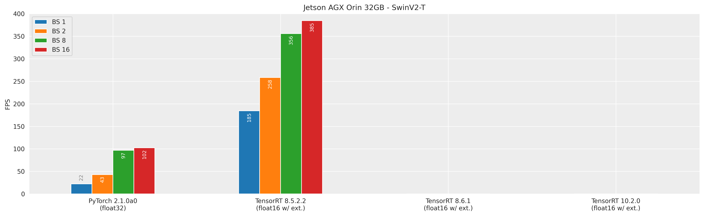
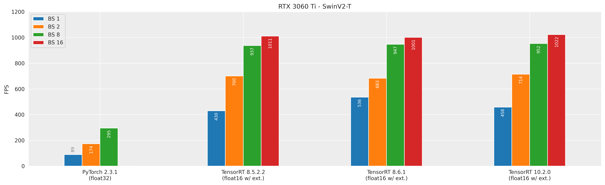
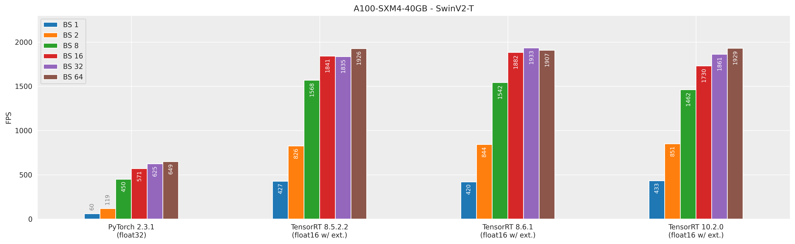
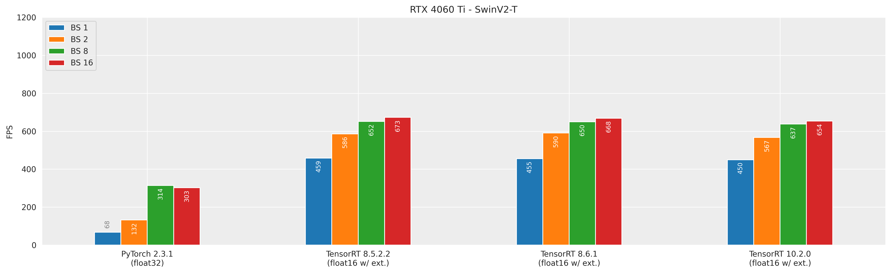

# Swin Transformer with TensorRT

To accelerate the Swin Transformer backbone using NVIDIA TensorRT, we provide a specialized 
TensorRT plugin. 
This plugin is based on NVIDIA's [FasterTransformer](https://github.com/NVIDIA/FasterTransformer) and 
incorporates several modifications available as a patch file for the original repository.
Our modifications enable ONNX import of a model featuring Swin Transformer, access to skip connections, and support for non-square input images. The plugin is compatible with most models that utilize the Swin Transformer as a backbone, not just our EMSAFormer model. For a detailed description of the changes, we refer to the [Changelog](#changelog) section.


## Content

- [Installation](#installation): Set up FasterTransformer including our modifications
- [Inference](#inference): Use the plugin for inference with TensorRT
    - [ImageNet Inference](#imagenet-inference): Verify the accuracy of the plugin on ImageNet
    - [Custom Usage](#custom-usage): Use the plugin in your own project
- [Changelog](#changelog): Changes compared to the official FasterTransformer repository


## Installation

We provide a patch file to apply our modifications to the FasterTransformer
repository. The patch file is based on the FasterTransformer v5.2.1 release.
It is assumed that you have already installed the [EMSAFormer](https://github.com/TUI-NICR/EMSAFormer) repository, [NVIDIA TensorRT](https://developer.nvidia.com/tensorrt) and the [FasterTransformer requirements](https://github.com/NVIDIA/FasterTransformer/blob/release/v5.2.1_tag/docs/swin_guide.md#requirements).

1. Update CMake:
    ```bash
    # CMake >= 3.18.0 is required for our build chain, if you are lazy, you can 
    # install cmake via pip:
    python3 -m pip install cmake==3.18.0

    # Ensure that correct version is used (may require ~/.local/bin in $PATH)
    which cmake
    cmake --version
    ```

2. Set up [CUDA](https://developer.nvidia.com/cuda-toolkit-archive), [CuDNN](https://developer.nvidia.com/rdp/cudnn-archive), and [TensorRT](https://developer.nvidia.com/tensorrt/download/):

    Our plugin requires CUDA, cuDNN, and TensorRT to be installed on your system. 
    If it is not installed, you can download the required versions from the NVIDIA website (see 
    links above). 
    
    > For NVIDIA Jetson, the system comes with pre-installed versions of CUDA, cuDNN, and TensorRT. 
      We used Jetpack 5.1.1 for our tests.

    We have tested the plugin with the following configurations:
    | GPU                   | CUDA  | cuDNN      | TensorRT   | Configuration |
    |-----------------------|-------|------------|------------|---------------|
    | Jetson AGX Orin 32GB  | 11.4  | 8.6.0.166  | 8.5.2.2    | 1             |
    | RTX 3060 Ti           | 11.8  | 8.6.0.163  | 8.5.2.2    | 2A            |
    |                       | 11.8  | 8.9.0.131  | 8.6.1      | 2B            |
    |                       | 12.1  | 8.9.7.29   | 10.2.0     | 2C            |
    | A100-SXM4-40GB        | 11.8  | 8.6.0.163  | 8.5.2.2    | 3A            |
    |                       | 11.8  | 8.9.0.131  | 8.6.1      | 3B            |
    |                       | 11.8  | 8.9.7.29   | 10.2.0     | 3C            |
    | RTX 4060 Ti           | 11.8  | 8.6.0.163  | 8.5.2.2    | 4A            |
    |                       | 11.8  | 8.9.0.131  | 8.6.1      | 4B            |
    |                       | 12.1  | 8.9.7.29   | 10.2.0     | 4C            |

    **Instructions for all configurations except Jetson AGX Orin 32GB**:

    ```bash
    DOWNLOAD_PATH=~/Downloads
    cd $DOWNLOAD_PATH

    # CUDA:
    # - you may skip driver installation if you  already have a compatible driver
    # - we assume that the link for /usr/local/cuda points to the correct version
    sudo sh cuda_*_linux.run

    # cuDNN
    CUDNN_VERSION=8.9.7.29
    cd ~/.local
    mkdir ./cudnn-${CUDNN_VERSION}
    tar -xvf $DOWNLOAD_PATH/cudnn*${CUDNN_VERSION}*.tar.xz --strip-components 1 -C ./cudnn-${CUDNN_VERSION}
    # rm cudnn
    ln -s ~/.local/cudnn-${CUDNN_VERSION} ~/.local/cudnn

    # TensorRT
    TRT_VERSION=10.2.0.19
    cd ~/.local
    tar -xzvf $DOWNLOAD_PATH/TensorRT-${TRT_VERSION}*.tar.gz -C ./
    # rm tensorrt
    ln -s ~/.local/TensorRT-${TRT_VERSION} ~/.local/tensorrt

    # TensorRT Python package.
    # Please be sure to install the package that matches your Python version.
    # For example, for Python 3.8:
    python3 -m pip install ~/.local/tensorrt/python/tensorrt-*cp38*.whl
    ```

    Further add to your `.bashrc`:

    ```bash
    # CUDA
    VERSION_CUDA='cuda'
    export PATH=/usr/local/$VERSION_CUDA/bin:$PATH
    export LD_LIBRARY_PATH=$LD_LIBRARY_PATH:/usr/local/$VERSION_CUDA/lib64:/usr/local/$VERSION_CUDA/lib
    export LIBRARY_PATH=$LIBRARY_PATH:/usr/local/$VERSION_CUDA/lib64:/usr/local/$VERSION_CUDA/lib
    export CPATH=$CPATH:/usr/local/$VERSION_CUDA/include
    # otherwise use: sudo ldconfig /usr/local/$VERSION_CUDA/lib64

    # CuDNN
    VERSION_CUDNN='cudnn'
    export LD_LIBRARY_PATH=$LD_LIBRARY_PATH:~/.local/$VERSION_CUDNN/lib
    export LIBRARY_PATH=$LIBRARY_PATH:~/.local/$VERSION_CUDNN/lib
    export CPATH=$CPATH:~/.local/$VERSION_CUDNN/include

    # TensorRT
    VERSION_TENSORRT='tensorrt'
    export PATH=~/.local/$VERSION_TENSORRT/bin:$PATH
    export LD_LIBRARY_PATH=$LD_LIBRARY_PATH:~/.local/$VERSION_TENSORRT/lib
    export LIBRARY_PATH=$LIBRARY_PATH:~/.local/$VERSION_TENSORRT/lib
    export CPATH=$CPATH:~/.local/$VERSION_TENSORRT/include
    ```

3. Install PyTorch
    
    We refer to the [PyTorch website](https://pytorch.org/get-started/locally/) for the installation of PyTorch.

    For Jetson AGX Orin 32GB, we used PyTorch 2.0.0/2.1.0 from 
    [NVIDIA Forum](https://forums.developer.nvidia.com/t/pytorch-for-jetson/72048) 
    (see *Instructions* to install TorchVision 0.15.1/0.16.1 as well)


4. Clone the FasterTransformer repository:

    ```bash
    # Navigate to the tensorrt_swin directory as we use it as our working directory
    # for the following steps
    cd tensorrt_swin

    # Clone the repository on the correct version
    git clone https://github.com/NVIDIA/FasterTransformer.git --branch release/v5.2.1_tag --single-branch

    # Navigate to the FasterTransformer directory
    cd FasterTransformer/
    ```

5. Download and apply our patch file:

    ```bash
    # Download the patch file to apply our modifications to the FasterTransformer repo
    wget https://github.com/TUI-NICR/EMSAFormer/releases/download/release_2024_07_19/fastertransformer_nicr.patch

    # The patch file applies our modifications to the FasterTransformer repository
    # and only works with the FasterTransformer v5.2.1 release.
    git apply ../fastertransformer_nicr.patch
    ```

6. Build modified FasterTransformer:

    ```bash
    # Execute the following commands in the FasterTransformer directory
    # If you use conda, be sure to activate your environment

    # Configure
    mkdir build ; cd build
    cmake -DCMAKE_BUILD_TYPE=Release ..

    # Build the project
    make -j  # Use as many threads as you like
    ```

7. Verify the build:

    ```bash
    # Within the build directory you can execute the following command to verify
    # the build
    tree -L 1 bin/ -L 1 lib/

    # The output should look similar to this:
    bin/
    └── swin_gemm  # Binary for testing GEMM operations
    lib/ # Required libraries for the plugin
    ├── ...
    ├── libswinTransformerBlock_plugin.so
    ├── libswinTransformerPatchMerging_plugin.so
    ├── libswinTransformer_plugin.so
    └── ...

    # After the successful build you can navigate back to the tensorrt_swin directory
    cd ../../

    # By executing the following command you can see the overall folder structure
    tree -L 1

    # The output should similar to this:
    ├── FasterTransformer # FasterTransformer repo
    ├── fastertransformer_nicr.patch # The patch file to apply our modifications to the FasterTransformer repo
    ├── README.md
    ├── tests # Some internal tests
    ├── trt_imagenet.py # Example script for ImageNet inference
    └── utils # Some required utils for exporting the model and inference
    ```

    > Note, for our examples, we expect you to follow the proposed folder structure.
      However, you can use the `FASTER_TRANSFORMER_PATH` environment variable to set a custom path 
      for the FasterTransformer repository, i.e.,  
      `export FASTER_TRANSFORMER_PATH=/path/to/FasterTransformer`  
      For your own applications, you must ensure to load the plugin yourself.

8. [Optional] Runtime dependencies for our examples:

    Our examples rely on the [CUDA Python](https://github.com/NVIDIA/cuda-python)
    package, which can be installed using pip:
    
    ```bash
    # CUDA Python: Ensure to install the correct version that matches your CUDA installation
    python3 -m pip install cuda-python==11.5    # for Jetson AGX Orin 32GB with Jetpack 5.1.1
    python3 -m pip install cuda-python==12.1
    ```
    
    > Note: While Jetpack 5.1.1 includes CUDA 11.4, we use CUDA 11.5 for the cuda-python package, as it is the closest available version on PyPI.

## Inference

For inference, we provide some examples. 
To verify that our plugin works correctly, we provide a script for ImageNet 
inference. 
Furthermore, we provide a script for inference with EMSAFormer. 
Finally, we provide a reference how the plugin can be used in other 
projects.


### ImageNet inference

The `trt_imagenet.py` script can be used to infer ImageNet with a model featuring a Swin 
Transformer backbone. 
The script uses the validation split of ImageNet and the pretrained weights provided by 
[torchvision](https://pytorch.org/vision/main/models/swin_transformer.html).
The script verifies the accuracy of the model and prints the top-1 and top-5
accuracy. 
Furthermore, it compares the output of the TensorRT plugin with the output of the PyTorch model. 
It is assumed that you already have downloaded the
[ImageNet validation](https://www.image-net.org/download.php) split.

> Note, the script uses parts of torchvision reference code, which are not included in the
  installed torchvision package.  
  Therefore, you need to clone torchvision in the `tensorrt_swin` directory:  
  `git clone https://github.com/pytorch/vision.git --branch v0.15.2 --single-branch`

The script can be executed with the following command:
```bash
python trt_imagenet.py \
    --model swin_t_v2 \
    --batch-sizes 1 \
    --fp16 \
    --data-path /path/to/imagenet/val
```

The output should look similar to:

```text
...
TRT: Acc@1 82.060 Acc@5 96.004
torch_output vs plugin_output:
mean diff :  0.002748552244156599
max diff :  0.017073392868041992
```

Note, the accuracy is slightly different to the one [reported in torchvision](https://pytorch.org/vision/main/models/generated/torchvision.models.swin_v2_t.html#torchvision.models.swin_v2_t) due to the different implementations and fixed float16 inference.

Below, we compare the results for different configurations for SwinV2-T (other Swin configurations work as well):










> Note: For TensorRT 10, converting to ONNX and TensorRT may also work without the extension.


## Custom usage

In the following, we describe how to use the plugin in your own project.
For this, we assume that you have already installed the FasterTransformer repository with our modifications.

1. ONNX export of the model with our utils:
    We provide scripts for exporting the model to ONNX. 
    In the `utils` directory, you can find the `onnx_exporter.py` script that provides the 
    `export_swin_to_onnx` function, which is a drop-in replacement for the [`torch.onnx.export`](https://pytorch.org/docs/2.0/onnx.html#torch.onnx.export) function.
    Your script must import the function and use it to export the model to ONNX.
    The modified function does the following:
    - Replace Swin Transformer Blocks and Patch Merging Layers with custom modules that will get own 
      nodes in the ONNX graph
    - Convert weights to expected format for the plugin while bypassing some strange TensorRT 
      behavior when using nodes with [more than 14 inputs](https://github.com/NVIDIA/TensorRT/issues/2246)
    - Add attributes to the nodes that are required for float16 inference

    > Note: The `export_swin_to_onnx` function requires batch size set to 1, even if you want to use a different batch size for inference later.

2. Time the GEMM (General Matrix Multiply) on your target hardware:
    The FasterTransformer repository provides a binary for testing the different GEMM operations.
    This way the optimal [cuBLAS GEMM Algorithm](https://docs.nvidia.com/cuda/cublas/index.html#cublasgemmalgo-t)
    can be determined. 
    As the performance of the algorithm depends on the target hardware, input resolution, and 
    batch size, it is recommended to run the benchmark every time you change one of these parameters.

    The binary is located in the `bin` directory of the build directory. 
    The binary can be executed with the following command:

    ```bash
    # Binary is located in tensorrt_swin/FasterTransformer/build/bin directory.
    # It takes arguments in the following order (all required):
    # - batch_img - used batch size (e.g., 1)
    # - image_width - width of the input image (i.e., 640 for EMSAFormer)
    # - image_height - height of the input image (i.e., 480 for EMSAFormer)
    # - window_width - width of the window size (i.e., 8 for EMSAFormer)
    # - head_num - number of attention heads in the first block (i.e., 4 for EMSAFormer)
    # - size_per_head - size of the attention head (i.e., 32)
    # - data_type - data type of the input (i.e., 0 for float32, 1 for float16)
    ./swin_gemm 1 640 480 8 4 32 1
    ```
    In the same working directory, a file named `gemm_config.in' is created. 
    This file contains the optimal algorithm for the GEMM operation and gets 
    loaded by the plugin at runtime from the same directory where TensorRT is 
    executed from. If the file is not found the plugin will use the default 
    algorithm.
    
    > Note that you can also set the environment variable `SWIN_GEMM_CONFIG_PATH` 
      to the path of the `gemm_config.in` file.

3. Load the plugin with TensorRT:
    The plugins are built as shared libraries and are located in the `lib` directory of the build 
    directory. 
    As loading the plugin depends on the application, we refer to the 
    [TensorRT documentation](https://docs.nvidia.com/deeplearning/tensorrt/developer-guide/index.html#using-plugin-library) 
    for loading the plugin.
    However, we provide an example on how to load the plugin with the [trtexec](https://docs.nvidia.com/deeplearning/tensorrt/developer-guide/index.html#trtexec) tool, 
    which is part of the TensorRT installation.

    ```bash
    trtexec \
        --onnx=path/to/onnx/model.onnx \
        --plugins=tensorrt_swin/FasterTransformer/build/lib/libswinTransformer_plugin.so \
        --fp16
    ```

    > Note that the `--plugins` argument can also be a directory containing multiple plugins. 
      In our case `libswinTransformer_plugin.so` already contains all required plugins.

# Changelog

As previously mentioned, our plugin is based on the NVIDIA's 
[FasterTransformer](https://github.com/NVIDIA/FasterTransformer) repository, with several modifications implemented. 
The following changelog details the changes we made to the original repository:

- split `SwinTransformerPlugin` into `SwinTransformerBlockPlugin` and 
  `SwinTransformerPatchMergingPlugin` for finer control over the graph structure; this enables 
  access to skip connections and alternative patch embedding methods (e.g., the one used in EMSAFormer)
- add support for non-square input images through zero-padding CUDA implementation
- move weights from node attributes to node inputs, allowing for TensorRT optimizations and simplified ONNX export
- add environment variable `SWIN_GEMM_CONFIG_PATH` for setting the path to the `gemm_config.in` file 
  that stores the optimal GEMM algorithm for the plugin
- removed code unrelated to Swin (e.g., ViT and LLMs) as we focus on Swin Transformer
- removed int8 support as it is beyond the scope of our work
- fixed CUDA 12 support
- adjusted LayerNorm epsilon value from 1e-6 to 1e-5 to match torchvision's default
- partially updated FMHA kernels based on the [TensorRT Open Source Software components](https://github.com/NVIDIA/TensorRT/tree/release/8.6/plugin/bertQKVToContextPlugin/fused_multihead_attention_v2/src)
